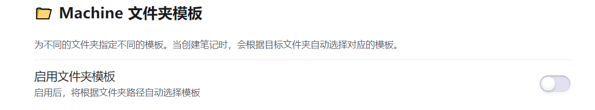

# 🎯 Machine Tracker

**An Obsidian plugin that quickly generates HTB penetration testing note templates to help manage and query your knowledge vault**

Easily manage and track your learning progress on [HackTheBox](https://hackthebox.com)

English | [简体中文](README.md)

---

 

## 📖 Introduction

Machine Tracker is an Obsidian plugin that helps you systematically manage your HackTheBox learning records in your knowledge vault. Inspired by the Obsidian Douban plugin, it fetches target machine information through HTB's API and generates customizable templates, supporting different templates for different folders.

**Supported Content Types:**

- 🖥️ **Machines** - HTB Virtual Machines (auto-fetch OS, difficulty, IP, and 40+ field information)
- 🎯 **Challenges** - CTF Challenges (auto-fetch category, name, difficulty, and 50+ field information)
- 🔍 **Sherlocks** - Forensics Challenges (auto-fetch scenario, category, name, difficulty, and 40+ field information)

---

## ✨ Core Features

- 🔍 **Smart Search** - Quick HTB platform search, fuzzy matching, one-click note creation
- 📝 **Custom Templates** - Flexible YAML template system, 50+ available variables
- 📂 **Folder Templates** - Different folders can use independent templates for flexible content management
- 📁 **Smart Path Management** - File path autocomplete, remember last input
- 🌍 **Internationalization** - Chinese/English interface, UTC+8 timezone display

---

## 📦 Installation

### Install from GitHub

1. Download the latest `main.js`, `manifest.json`, and `styles.css` from [Releases](https://github.com/Ryanu9/Obsidian-Machine-Tracker/releases)
2. Create folder `.obsidian/plugins/machine-tracker/` in your vault
3. Copy the downloaded files to this folder
4. Restart Obsidian
5. Enable **Machine Tracker** plugin in settings

---

## 🚀 Quick Start

### 1. Configure API Token

Visit [HackTheBox Settings](https://app.hackthebox.com/profile/settings) to create an App Token, then configure it in plugin settings.

### 2. Search and Import

1. Press `Ctrl/Cmd + P` to open command palette
2. Type `HTB` to see available commands
3. Select search type (Machine/Challenge/Sherlock)
4. Enter keywords and select target
5. Auto-create formatted notes

### 3. Customize Templates (Optional)

The plugin uses built-in templates by default with all fields (for your convenience to choose the content you want). Please **delete the fields you don't need** or add other custom fields you want to create a template that suits you.

---

## ❓ FAQ

**Q: Is mobile supported?**  
A: Yes, but some features may be limited on mobile devices.

**Q: Where is data stored?**  
A: All data is stored in your Obsidian vault. The plugin does not upload data to external servers.

**Q: Can I customize note templates?**  
A: Yes, you can fully customize YAML templates in plugin settings.

**Q: How to configure separate templates for each folder?**  
A: Enable folder templates below

---

## 📄 License

This project is licensed under the [MIT License](LICENSE).

---

## 🙏 Acknowledgments

- [Obsidian](https://obsidian.md/) - Powerful knowledge management tool
- [HackTheBox](https://hackthebox.com) - Quality cybersecurity learning platform
- All contributors and users

---

## ⚠️ Disclaimer

This plugin is for educational and note-taking purposes only and is not affiliated with HackTheBox. Please follow HTB platform rules and learning guidelines.
