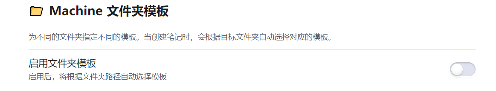

# 🎯 Machine Tracker

**一款能够快速生成HTB渗透测试笔记模版的Obsidian 插件，有助于对您的知识库进行管理查询**

  

轻松管理和追踪 [HackTheBox](https://hackthebox.com) 平台上的学习进度

[English](README.en.md) | 简体中文

---

 

## 📖 基本介绍

Machine Tracker 是一款 Obsidian 插件，帮助您在知识库中系统化管理 HackTheBox 学习记录。参考了Ob豆瓣插件的原理，通过请求HTB的API来获取目标机器对应的信息，然后生成为您可以自定义的模版，支持对不同文件夹下应用不同的模版。

**支持内容类型：**

- 🖥️ **Machines** - HTB 靶机（自动获取 OS、难度、IP 等40+字段信息）
- 🎯 **Challenges** - CTF 挑战（自动获取 分类 名字 难度 等50+字段信息）
- 🔍 **Sherlocks** - 取证挑战（自动获取场景 分类 名字 难度 等40+ 字段信息）

---

## ✨ 核心功能

- 🔍 **智能搜索** - 快速搜索 HTB 平台内容，模糊匹配，一键创建笔记
- 📝 **自定义模板** - 灵活的 YAML 模板系统，50+ 可用变量
- 📂 **文件夹模板** - 不同文件夹可应用独立模板，灵活管理不同类型内容
- 📁 **智能路径管理** - 文件路径自动补全，记忆上次输入
- 🌍 **国际化支持** - 中文/英文界面，UTC+8 时区显示

---

## 📦 安装

### 从 GitHub 安装

1. 从 [Releases](https://github.com/Ryanu9/Obsidian-Machine-Tracker/releases) 下载最新版本的 `main.js`、`manifest.json` 和 `styles.css`
2. 在你的 vault 中创建文件夹 `.obsidian/plugins/machine-tracker/`
3. 将下载的文件复制到该文件夹
4. 重启 Obsidian
5. 在设置中启用 **Machine Tracker** 插件

---

## 🚀 快速开始

### 1. 配置 API Token

前往 [HackTheBox Settings](https://app.hackthebox.com/profile/settings) 创建 App Token，然后在插件设置中配置。

### 2. 搜索并导入

1. 按 `Ctrl/Cmd + P` 打开命令面板
2. 输入 `HTB` 查看可用命令
3. 选择搜索类型（Machine/Challenge/Sherlock）
4. 输入关键词并选择目标
5. 自动创建格式化笔记

### 3. 自定义模板（可选）

默认使用内置模版，且默认为全字段（方便您自己选择自己想要的内容）请**删除您不需要的字段**，或者添加您想要的其他自定义字段，制作好适合您的模版

---

## ❓ 常见问题

**Q: 支持移动端吗？**  
A: 支持，但部分功能在移动端可能受限。

**Q: 数据存储在哪里？**  
A: 所有数据存储在您的 Obsidian vault 中，插件不会上传数据到外部服务器。

**Q: 可以自定义笔记模板吗？**  
A: 可以，在插件设置中完全自定义 YAML 模板。

**Q: 如何为每个文件夹下单独配置模版？**  
A: 开启下方的文件模版

---

## 📄 许可证

本项目采用 [MIT License](LICENSE) 许可。

---

## 🙏 致谢

- [Obsidian](https://obsidian.md/) - 强大的知识管理工具
- [HackTheBox](https://hackthebox.com) - 优质的网络安全学习平台
- 所有贡献者和使用者

---

## ⚠️ 免责声明

本插件仅用于学习和记录目的，与 HackTheBox 官方无关。请遵守 HTB 平台规则和学习准则。